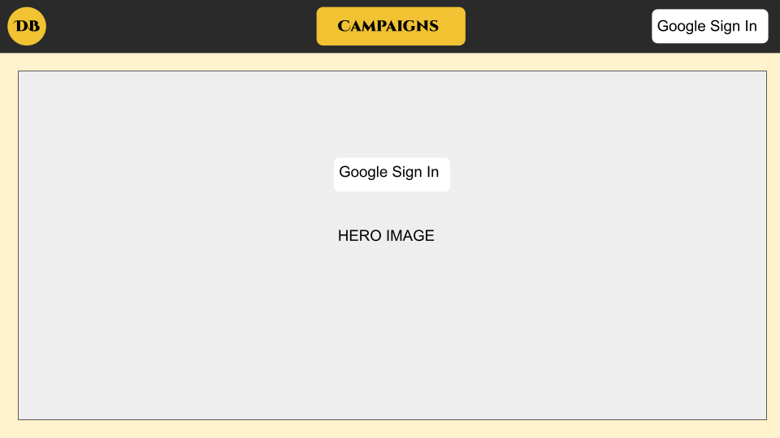

# Dungeon Buddy

Dungeon Buddy is a complementary web-app for dunegon masters to help plan out and keep track of events in their campaigns. Users can create campaigns, locations within them, and assign monster encounters to those locations.

## API

Dungeon Buddy will use the Open5e API to retrieve information on monsters.

Example:
```
const ROOT_URL = 'https://api.open5e.com/v1'
fetch(`${ROOT_URL}/monsters/?slug__in=adult-bronze-dragon`)
```
Retrieves:
```
{
    "index": "aboleth",
    "name": "Aboleth",
    "size": "Large",
    "type": "aberration",
    "alignment": "lawful evil",
    ...
}
```

## Tech Required

- HTML/CSS
- JavaScript
- MongoDB
- Mongoose
- Node.js
- Express
- Passport

## ERD


## RESTful Routing Chart

| HTTP METHOD (_Verb_) | URL (_Nouns_)                      | CRUD        | Response                                                             | Notes          |
| -------------------- | ---------------------------------- | ----------- | -------------------------------------------------------------------- | -------------- |
| `users`              |                                    |             |                                                                      |                |
| GET                  | `/users/all`                       | READ        | array of users                                                       | Stretch goal, admin required |
| GET                  | `/auth/google`                     | READ        | offload login to google                                              |                |
| GET                  | `/auth2callback`                   | READ/CREATE | select in or add user to database after successful google oauth      |                |
| DELETE               | `/users/`                          | DESTROY     | destroy user with id of :userId                                      |                |
| GET                  | `/users/`                          | READ        | array of campaigns made by user with id of :userId & basic user info |                |
| POST                 | `/users/:userdId/campaigns`        | CREATE      | create a campaign under user with id of :userId                      |                |
| `campaigns`          |                                    |             |                                                                      |                |
| GET                  | `/campaigns/:campaignId`           | READ        | one campaign with id of :campaignId                                  |                |
| DELETE               | `/campaigns/:campaignId`           | DESTROY     | destroy campaign with id of :campaignId                              |                |
| POST                 | `/campaigns/:campaignId/locations` | CREATE      | create a location under campaign with id of :campaignId              |                |
| PUT                  | `/campaigns/:campaignId`           | UPDATE      | edit campaign title, description, and image                          |                |
| `locations`          |                                    |             |                                                                      |                |
| DELETE               | `/locations/:locationId`           | DESTROY     | destroy location from array of locations                             |                |
| GET                  | `/locations/:locationId`           | READ        | one location with id of :locationId & array of monsters              |                |
| POST                 | `/locations/:locationId`           | CREATE      | add monster to array of monsters                                     |                |
| PUT                  | `/locations/:locationId`           | UPDATE      | remove monster from array of monsters                                |                |
| PUT                  | `/locations/:locationId/update`    | UPDATE      | edit location title, description, and image                          |                |

## Wireframes




## MVP Goal

- Thematically appropriate page design
- Log users in
- Creation of campaigns
- Creation of locations within campaigns
- Nesting locations within locations
- Removing locations from campaigns
- Removing locations from other locations
- Adding monsters to locations
- Removing monsters from locations
- Browse monsters from list / search for monsters
- Store campaigns/locations/monsters in database

## Stretch Goals

- Fluid access to information (reduce separate pages for information: cards, accordion, etc)
- Keep track of health for individual monster instances
- Add other encounters/events: friendly-npc? shopkeeper, innkeeper, etc
- Custom visuals for nav/buttons/etc
- locations within locations

## Potential Roadblocks

- Organizing the data retrieved from the API
- Displaying data in an efficient manner
